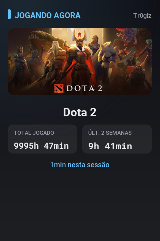
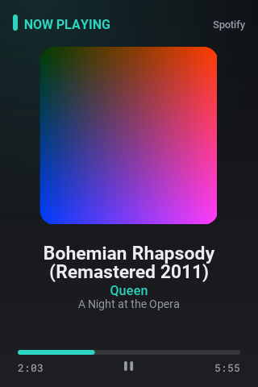
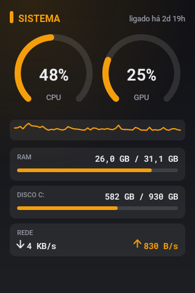
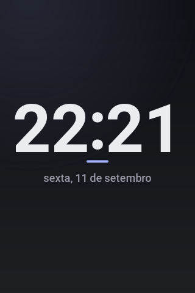
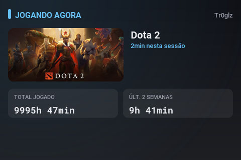
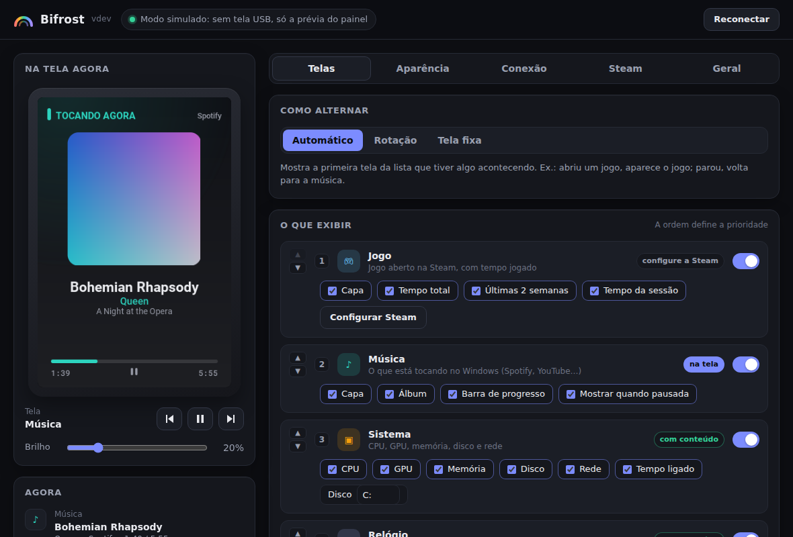

<p align="center"></p>

# Bifrost

A lightweight panel for the **Turing / UsbMonitor 3.5"** USB screen, replacing the official app:
shows the **music playing**, the **game open on Steam**, **PC usage** and a **clock**,
with a control panel so you can choose what shows up and how.

A single binary, written in Go. No need to install Python or anything else.
Runs on **Windows**, **Linux** and **macOS** — see [Platforms](#platforms) for what differs between them.

## Screenshots

<table>
<tr>
<td align="center" width="25%"><br><sub><b>Game</b> (Steam)</sub></td>
<td align="center" width="25%"><br><sub><b>Music</b></sub></td>
<td align="center" width="25%"><br><sub><b>System</b></sub></td>
<td align="center" width="25%"><br><sub><b>Clock</b></sub></td>
</tr>
</table>

<p align="center"></p>
<p align="center"><sub>Portrait, flipped portrait, landscape or flipped landscape — orientation is adjustable from the panel.</sub></p>

<p align="center"></p>

## What it does

- **Music**: title, artist, album, cover art and progress bar for whatever player shows up
  in Windows' media controls (Spotify, YouTube in the browser, Deezer, Media Player…). No login required.
- **Game (Steam)**: name, cover art, total playtime, last 2 weeks and current session time,
  read directly from the Steam install on your PC, no API key needed.
- **System**: CPU, GPU, memory, disk, network, and how long the PC has been on.
- **Clock**: time and date, in 12- or 24-hour format, with or without seconds.
- **Multiple screens**: connect more than one USB screen and configure each independently —
  different orientation, brightness, and switching mode per screen (e.g. one fixed on System,
  another rotating through Music/Game). New screens are auto-detected; see
  [Multiple screens](#multiple-screens) for details and limitations.
- **Control panel**, to choose:
  - which screens show up and in what order;
  - how they switch: automatic (shows whatever is happening), rotation, or a fixed screen;
  - what each screen displays;
  - colors, background, orientation (portrait or landscape) and brightness, with a live preview.
- **Tray icon** near the clock: opens the panel, switches screens, pauses, reconnects.
- **Resolves conflicts with the official app**: if UsbMonitor is holding the port,
  the panel shows what it is and offers a button to close it.
- Reconnects on its own if the USB cable is unplugged, and only sends the part of the image that changed.

## Platforms

| Feature | Windows | Linux | macOS |
|---|---|---|---|
| Screen (USB serial) | ✅ | ✅ | ✅ |
| Panel (web UI) | ✅ embedded window | ✅ opens in the browser | ✅ opens in the browser |
| Tray icon | ✅ | ✅ | ✅ |
| System stats (CPU/GPU/RAM/disk/temps) | ✅ | ✅ CPU/GPU temps depend on `lm-sensors`/`nvidia-smi` being available | ✅ CPU % is an approximation (no CGO); no temperatures |
| Now playing | ✅ Windows Media Controls (any player) | ✅ MPRIS (Spotify, VLC, browsers, etc.) | ⚠️ Music.app and Spotify only, via AppleScript (no cover art) |
| Steam — local detection | ✅ registry + local files | ❌ use **Steam Web API** instead (Steam tab) | ❌ use **Steam Web API** instead (Steam tab) |
| Steam — Web API | ✅ | ✅ | ✅ |
| Autostart with the system | ✅ registry | ✅ XDG autostart (`~/.config/autostart`) | ✅ LaunchAgent (`~/Library/LaunchAgents`) |
| Conflict detection (official app) | ✅ | n/a (Windows-only official app) | n/a (Windows-only official app) |

On Linux/macOS there's no embedded window, so the panel opens in your default browser instead
(still only reachable from `127.0.0.1`).

## Multiple screens

Add as many screens as you have in the **Connection** tab. Each one gets its own port, model,
orientation, brightness, and switching mode — so you can, for example, pin one screen to always
show System stats and let another rotate through Music/Game.

A screen's **Port** can be left as **Automatic**, in which case Bifrost claims any detected,
unclaimed screen for it, or pinned to a specific port if you want a stable, predictable mapping.

> **Known limitation**: the cheap Turing/UsbMonitor clones typically report the same hardware
> VID/PID/serial number for every unit of the same model, so Bifrost can't tell two identical
> physical screens apart by hardware identity alone — only by which port they're plugged into.
> If you have two or more identical screens, pin each one to a specific port (once you've
> figured out which port is which, e.g. by flashing the brightness) for a mapping that survives
> reboots; leaving them all on "Automatic" still works, but which physical screen ends up as
> "which" device can shuffle between runs.


## Languages

Bifrost's panel and screen also speak **English**, **Português**, **Español**, **日本語 (Japanese)** and **中文 (Mandarin)**.
By default it auto-detects the language configured in Windows; you can also pick one manually in the **General** tab of the panel.

> Note: the physical LCD screen uses an embedded Latin font (Roboto), which doesn't include Japanese/Chinese glyphs.
> When Japanese or Mandarin is selected, the **physical screen** falls back to English, while the **web panel** and the
> **tray icon** are fully translated.

## How to use

1. Download the binary for your OS from **Releases** (or build it yourself, see below) and put it in a folder.
2. Open it. The panel opens (an embedded window on Windows, your browser on Linux/macOS)
   and the rainbow icon appears in the tray.
3. If the panel warns that **another program is using the screen** (Windows only, official app),
   check the official app in the list and click **Close selected and connect**. Windows will ask
   for administrator permission, because the official app runs as administrator. After that,
   disable the official app's autostart in Task Manager, under the *Startup apps* tab.
4. Done. Open a game through Steam and it shows up on the screen within seconds.

Closing the panel window **does not** turn off the screen. Bifrost keeps running from the tray
icon. To quit for good: right-click the icon → **Quit** (or Ctrl+C in the terminal if the tray
icon isn't available on your desktop environment).

### Steam

By default, Bifrost reads the game **directly from the Steam app installed on your PC**. It uses:

- the Windows registry, which reports the open game;
- library manifests, for the game's name;
- `localconfig.vdf`, for playtime and account;
- Steam's image cache, for the cover art.

No API key needed, doesn't depend on profile privacy, works offline, and detects
the game in about 2 seconds.

If you play on **another PC**, switch the source to **Steam Web API** in the Steam tab of the panel:

1. Click **Generate my key** and create a Steam Web API key (for "Domain Name" you can use `localhost`).
2. Click **Find my ID** to get your SteamID64 (17 digits).
3. In Steam's privacy settings, set **Game details** to **Public**.
4. Click **Test**.

## Where data is stored

`%APPDATA%\Bifrost\` on Windows, `~/.config/Bifrost/` on Linux, `~/Library/Application Support/Bifrost/`
on macOS. Holds `config.json`, `bifrost.log` and the cover art cache.

**Portable mode**: if a `dados` folder exists next to the binary, everything is saved there instead.

**Diagnostics**: `bifrost --diagnostico` (`bifrost.exe` on Windows) generates a `diagnostico.txt` with
serial ports, conflicting programs, the music playing, and system readings. Useful when opening an issue.

## Building

Requires [Go 1.24+](https://go.dev/dl/).

On Windows, for a quick local build (`dist\bifrost.exe`):

```bat
build.bat 1.0.0
```

For Windows + Linux + macOS binaries (amd64 and arm64), from any OS with Go installed,
no CGO or cross-toolchain needed:

```sh
./build.sh 1.0.0
```

This writes `dist/bifrost-windows-amd64.exe`, `dist/bifrost-linux-{amd64,arm64}` and
`dist/bifrost-darwin-{amd64,arm64}`. To run the tests: `go test ./...`

## Structure

```
cmd/bifrost/        program entry point, tray icon, panel window, diagnostics
internal/app/       decides the current screen, keeps the connection, sends the frames
internal/i18n/      translation catalog and OS UI-language detection
internal/lcd/       screen protocol (revision A) and the serial port (Windows/Linux/macOS)
internal/render/    screen drawing (portrait and landscape)
internal/media/     music playing — Windows Media Control (WinRT), MPRIS/D-Bus on Linux, AppleScript (Music.app/Spotify) on macOS
internal/steam/     Steam: local reading (Windows registry + .vdf files) and Web API (all platforms)
internal/sysinfo/   CPU, GPU, memory, network and disk per platform
internal/web/       control panel (local server + UI)
internal/winutil/   processes, autostart, single instance, per platform
internal/update/    checks GitHub Releases for new versions and installs them
internal/config/    config.json
tools/genres/       generates the Windows .exe's icon, manifest and version
```

The panel is only served on `127.0.0.1` (not visible on the network) and rejects requests coming from other sites.

## Updating

Bifrost checks GitHub Releases for a newer version on startup and every 6 hours
(toggle in the **General** tab). When one is found, the panel shows a banner
with an **Update and restart** button — it downloads the right binary for your
OS/arch, verifies its SHA-256 against the release's `checksums.txt` when
available, replaces the running binary, and restarts. No data is sent anywhere
other than the public, unauthenticated GitHub API/CDN.

## Troubleshooting

| Problem | What to do |
|---|---|
| "Another program is using the screen" | Use the panel's button to close UsbMonitor, or close it from Task Manager. |
| "Screen not found" | Check the cable. In the **Connection** tab, see if a port is marked as "is the screen". |
| Odd colors or orientation | Adjust **Orientation** in the Appearance tab. |
| Music doesn't show up | The player needs to show up in Windows' media mini-player (the media keys). |
| Game doesn't show up | Click **Test** in the Steam tab. Games opened outside of Steam aren't detected. On the Web API, check the "Game details" privacy setting. |
| The screen gets hot | Lower the brightness. These screens get hot above ~50%. |

## Contributing

Bug reports, feature requests and PRs are welcome — see
[CONTRIBUTING.md](CONTRIBUTING.md) for how to set up a dev environment and the
project's conventions. Found a security vulnerability? Please don't open a
public issue — see [SECURITY.md](SECURITY.md) instead.

## License

GPL-3.0-or-later. The screen protocol was ported from
[turing-smart-screen-python](https://github.com/mathoudebine/turing-smart-screen-python).
Full credits in [THIRD_PARTY_NOTICES.md](THIRD_PARTY_NOTICES.md).

GPL-3.0 already guarantees you the right to use Bifrost commercially — that can't be taken away
by this project. If you build a product or service on top of it, we'd appreciate a credit/link
back to this repository and its author; that's a courtesy request, not a license condition.
